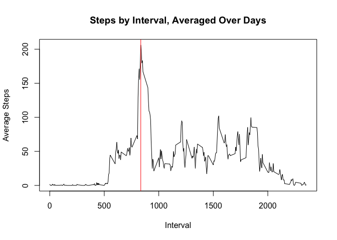

# Reproducible Research: Peer Assessment 1


## Loading and preprocessing the data
Before beginning to answer the questions about the details of the steps data, the activity.csv file was first imported and the "date" column converted from the factor to date class and computing totals by day.


```r
data0 <- read.csv("./activity.csv", header = TRUE)
## process data
data0$date <- as.Date(as.character(data0$date), "%Y-%m-%d")
```

## What is mean total number of steps taken per day?
To answer the question "What is mean total number of steps taken per day?", the data was first aggregated by sum and then plotted using hist().

```r
data1 <- aggregate(steps ~ date, data0, sum)
## exploratory histogram
hist(data1$steps, xlab = "Steps per Day", main = "Frequency of Steps Totals", col = "blue")
```

<!-- -->

From the histogram it is clear that the steps per day cluster in the 10000 - 15000 range. The mean and median of average steps by day are calculated to be at the low end of the range:


```r
mean(data1$steps)
```

```
## [1] 10766.19
```

```r
median(data1$steps)
```

```
## [1] 10765
```

## What is the average daily activity pattern?
The daily activity pattern can be seen in a time series plot of the average steps per interval. This plot is acheived by aggregating the steps data by mean and plotting against interval. The red vertical line indicates the maximum value.


```r
data2 <- aggregate(steps ~ interval, data0, mean)
plot(x = data2$interval, y = data2$steps, type = "l", 
     ylab = "Average Steps", xlab = "Interval", main = "Steps by Interval, Averaged Over Days")
abline(v = 835, col = "red")
```

<!-- -->

The maximum average steps occurrs at the following interval:

```r
maxInt <- data2[which.max(data2$steps),1]
maxInt
```

```
## [1] 835
```

## Imputing missing values
Doing a quick summary of the original data set data0 shows that there are 2304 missing values in the steps column.


```r
summary(data0)
```

```
##      steps             date               interval     
##  Min.   :  0.00   Min.   :2012-10-01   Min.   :   0.0  
##  1st Qu.:  0.00   1st Qu.:2012-10-16   1st Qu.: 588.8  
##  Median :  0.00   Median :2012-10-31   Median :1177.5  
##  Mean   : 37.38   Mean   :2012-10-31   Mean   :1177.5  
##  3rd Qu.: 12.00   3rd Qu.:2012-11-15   3rd Qu.:1766.2  
##  Max.   :806.00   Max.   :2012-11-30   Max.   :2355.0  
##  NA's   :2304
```

These NA values could be causing a skewed interpretation of the data. To mitigate this, the NA values were replaced with the steps averaged by interval and the data re-analyzed.

To start, two new columns were added: isNA, identifying whether the row was missing steps data and steps.y, with the mean steps grouped by interval. A sample from the new data set data3 is shown below.


```r
data3 <- data0
data3$isNA <- is.na(data0$steps)
data3 <- merge(data3, aggregate(steps ~ interval, data3, mean), by = "interval")
head(data3)
```

```
##   interval steps.x       date  isNA  steps.y
## 1        0      NA 2012-10-01  TRUE 1.716981
## 2        0       0 2012-11-23 FALSE 1.716981
## 3        0       0 2012-10-28 FALSE 1.716981
## 4        0       0 2012-11-06 FALSE 1.716981
## 5        0       0 2012-11-24 FALSE 1.716981
## 6        0       0 2012-11-15 FALSE 1.716981
```

As a final processing step, the original steps data was discarded where isNA column was TRUE and replaced with the appropriate interval mean.


```r
dataF <- subset(data3, isNA = FALSE, select = c(interval, steps.x, date))
dataT <- subset(data3, isNA = TRUE, select = c(interval, steps.y, date))
colnames(dataT)[2] <- "steps"
colnames(dataF)[2] <- "steps"
data4 <- rbind(dataT, dataF)
```

Following the pattern of the earlier histogram, the total steps per day was then found using aggregate and plotted with hist().


```r
data4 <- aggregate(steps ~ date, data4, sum)
hist(data1$steps, xlab = "Steps per Day", main = "Frequency of Steps Totals", col = "blue")
```

<!-- -->

Unsurprisingly, the mean and median steps per day in the new data set differ significantly from the averages of the original data. By imputing the NA values the mean and median have almost doubled.


```r
mean(data4$steps)
```

```
## [1] 20120.42
```

```r
median(data4$steps)
```

```
## [1] 21161.19
```

## Are there differences in activity patterns between weekdays and weekends?
To tease out the difference in activity pattern between week days and weekend, the factors "weekday" and "weekend" were first added to the data set by fnding the day of the week and then replacing with the desired factors.

```r
data5 <- data0
data5$day <- weekdays(data5$date)
week <- subset(data5, day %in% c("Monday", "Tuesday", "Wednesday", "Thursday", "Friday"))
weekend <- subset(data5, day %in% c("Saturday", "Sunday"))
week$day <- "weekday"
weekend$day <- "weekend"
```

"Week" and "weekend" data was then aggregated by mean and plotted in adjacent time series for comparison.


```r
week <- aggregate(steps ~ interval, week, mean)
weekend <- aggregate(steps ~ interval, weekend, mean)
library(ggplot2)
library(gridExtra)
plot1 <- ggplot(week, aes(interval, steps)) + geom_line() + labs(title = "weekday") + coord_cartesian(ylim = c(0,250))
plot2 <- ggplot(weekend, aes(interval, steps)) + geom_line() + labs(title = "weekend") + coord_cartesian(ylim = c(0,250))
grid.arrange(plot1, plot2, nrow=2)
```

<!-- -->

From the plots, there are a few differences between week and weekend days. On week days activity starts earlier and then peaks dramatically. Weekend activity has a smoother start with many smaller peaks at later intervals.
